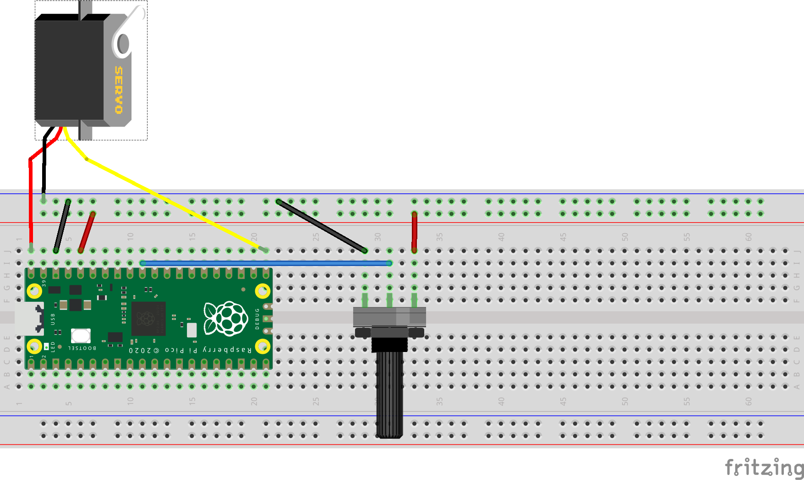

## servo example
**A tradition servo motor is capable of 180° of rotation. Here we automate a sweep motion with the servo and, secondly, apply manual movement with the use of potentiometer** <br />
<br />

**Note that we are using the VBUS pin of the Raspberry Pico to power the servo motor. This pin supplies 5 volts directly from the USB cable. 5 volts is required to power the servo, but should NEVER be introduced to other pins on the microcontroller!**

### servoSweep

It is suggested to begin with the code _servoSweep.py_ , to understand the basic behavior and to test if the motor is in fact acting as it should  <br />

The __minDuty__ and __maxDuty__ values found in the code are estimated for servo model Reely RS-606WP. These values may need to change for other models of servos. <br />

PWM is used to control the servo motor. We are required to define a frequency of 50 hertz, as follows:

```python
pwm.freq(50) #pulse of 50 times per second for a servo motor
```

### servoKnob

In the code _servoKnob.py_ we add a potentiometer to manually control the movement of our servo motor. <br />
Here we find use of 2 functions *_map()* and *constrain* . <br />
As in Arduino these functions are incredibly useful for managing ranges of differing values between an INPUT and an OUTPUT. <br />

These functions may be copied and pasted into any code when seeking to execute similar tasks. <br />

__constrain__ :

```python
def constrain(val, min_val, max_val):
    return min(max_val, max(min_val, val))
```

__map__ :

```python
def _map(x, in_min, in_max, out_min, out_max):
    return int((x - in_min) * (out_max - out_min) / (in_max - in_min) + out_min)
```

### Hookup guide:



