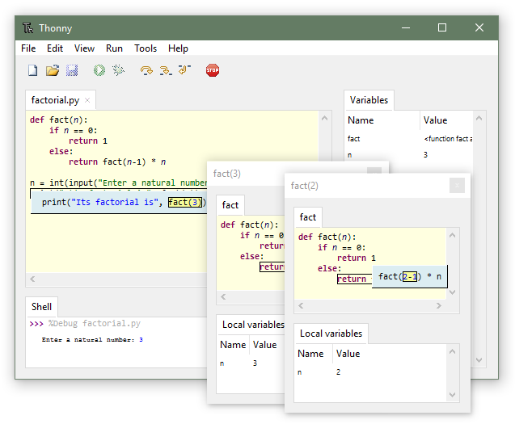

## Getting started with Micropython on the Raspberry Pico

### In this repository are included examples as follows  

| IO Function         | Exercise                               |
|---------------------|----------------------------------------|
| OUTPUT              | Blink a LED                            |
| INPUT               | add a push-button                      |
| INPUT & OUTPUT      | sequence 3 LEDs at push of a button    |
| ADC                 | add a potentiometer for analog input   |
| PWM                 | create varied luminosity of a LED      |
| PWM                 | automated control of a Servo motor     |
| PWM & ADC           | control a Servo motor with analog input|

 

### To follow the examples it is recommended to install Thonny (Python IDE for beginners)

For download instructions, visit [The official website](https://thonny.org "Official Thonny Website")

__Thonny Screenshot__

 

### Install Firmware onto the Raspberry Pico

1. Visit the official site to download the firmware file : [ **Here** ] (https://www.raspberrypi.org/documentation/rp2040/getting-started/#getting-started-with-micropython "Raspberry - getting started with micropython")

2. While pressing the _BOOTSEL_ button on the Raspberry Pico, connect it to your computer with a micro-USB cable.

3. The Raspberry Pico will appear as a USB storage device on your computer.

4. Drag and drop the downloaded file onto the mounted Raspberry device.

__Illustration from raspberry website:__

